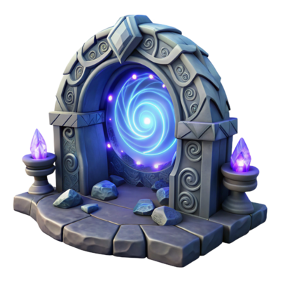

<div align="center">

  # NNekoPlugins
  
  <span></span>
  
  ### Meowhoo!

  # NNekoPlugins — Custom Dalamud Plugin Repository

Welcome to **NNekoPlugins**, a collection of high‑quality, open‑source Dalamud plugins designed to enhance the Final Fantasy XIV experience.  
This organization serves as the **central hub** for development, documentation, and distribution of all NNekoPlugins projects.

---

## 🌐 Plugin Index

Below is the current list of plugins maintained under this organization.  
Each plugin includes a link to its repository and a short description.

| Plugin | Description |
|--------|-------------|
| [NNekoTriggers](https://github.com/NNekoPlugins/NNekoTriggers) | Modular trigger system with DTR integration, zone triggers, RNG triggers, job‑swap triggers, and more. |
| [NNekoWeaponIcons](https://github.com/NNekoPlugins/NNekoWeaponIcons) | Adds a Clas/Job Icon Overlay in Armoury Chest. Split from VIWI plugin's Kitchen Sink module. |
| [AqrNarrator](https://github.com/NNekoPlugins/AqrNarrator) | Narrates A Quest Reborn dialog into a separate window. |
<!--| *(Add new plugins here as the ecosystem grows)* | |-->

If you maintain a plugin under this organization and want it listed here, submit a PR.

---

## 📦 Installing NNekoPlugins

~~You can install all NNekoPlugins through Dalamud’s **Custom Plugin Repositories** feature.~~

1. Open **XIVLauncher → Settings → Experimental**  
2. Enable **Custom Plugin Repositories**  
~~3. Add this URL:~~
3. Add the URL for the individual plugin from the list above.

<!--```-->
~~https://raw.githubusercontent.com/NNekoPlugins/.github/main/repo.json~~
<!--```-->


4. Save and refresh the plugin list  
~~5. All NNekoPlugins will now appear in the Dalamud plugin browser~~

---

## 🛠 Development & Contribution

We welcome contributions from the community.

### To contribute:
- Fork the plugin repository you want to work on  
- Follow the coding style enforced by `.editorconfig`  
- Ensure your changes pass CI (lint + build)  
- Submit a pull request  

For major changes, please open an issue first to discuss the proposal.

---

## 📄 License

All plugins in this organization are licensed under **AGPL‑3.0** unless otherwise stated.

---

## 💬 Community & Support

For questions, suggestions, or help with development, feel free to open an issue on the relevant plugin repository.

More community resources will be added as the ecosystem grows.

---

## 🧰 About NNekoPlugins

This organization exists to provide:

- A unified plugin ecosystem  
- Shared CI/CD infrastructure  
- Consistent coding standards  
- Reusable tooling and workflows  
- A centralized distribution channel  

If you're building a plugin and want to join the ecosystem, reach out!

</div>
